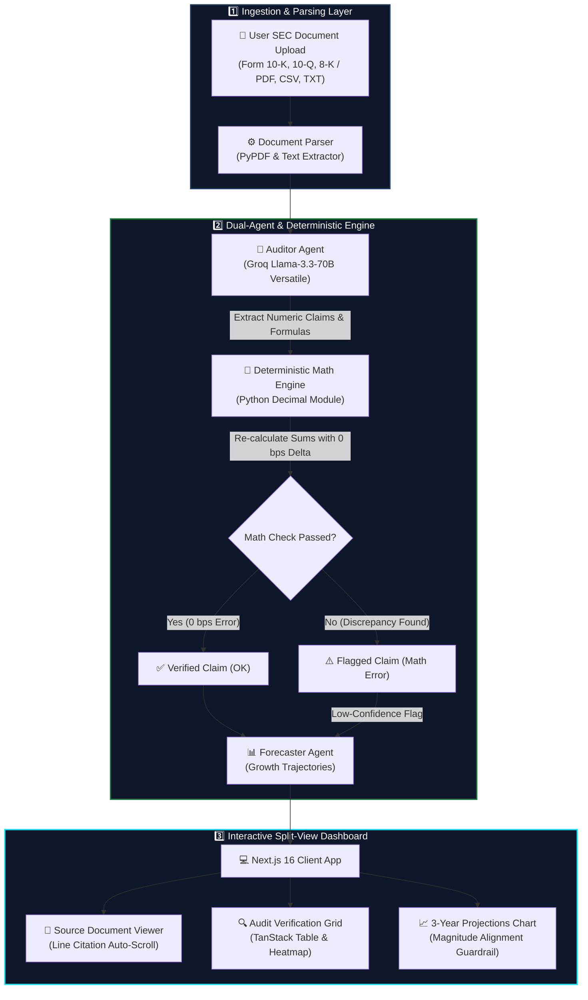
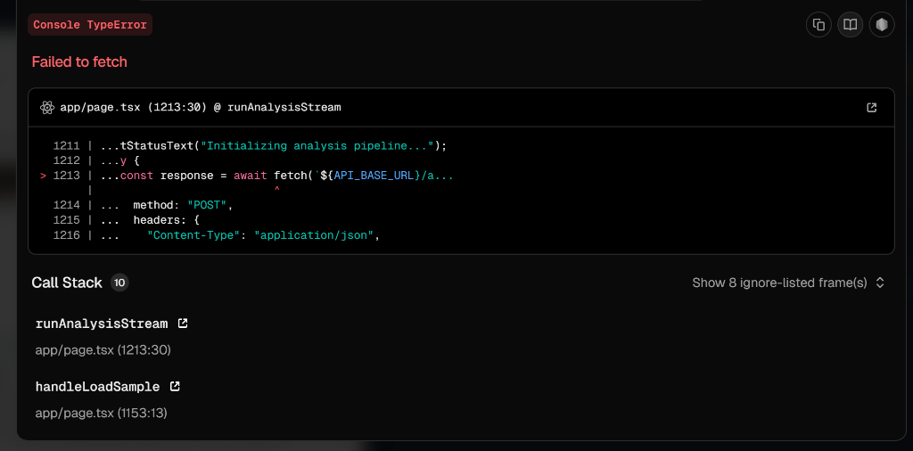
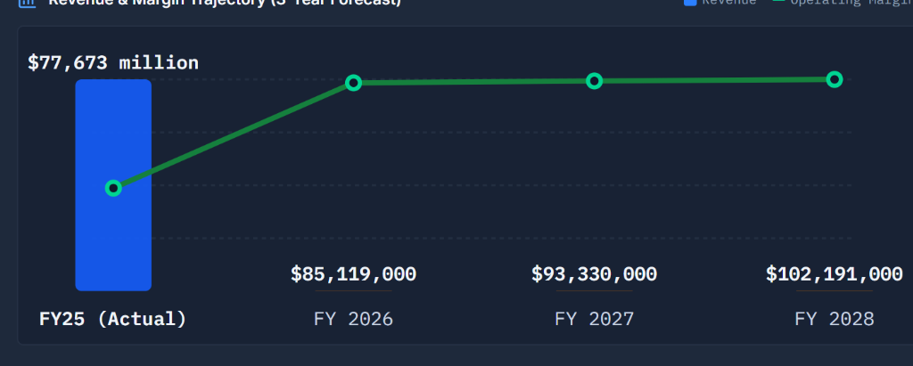
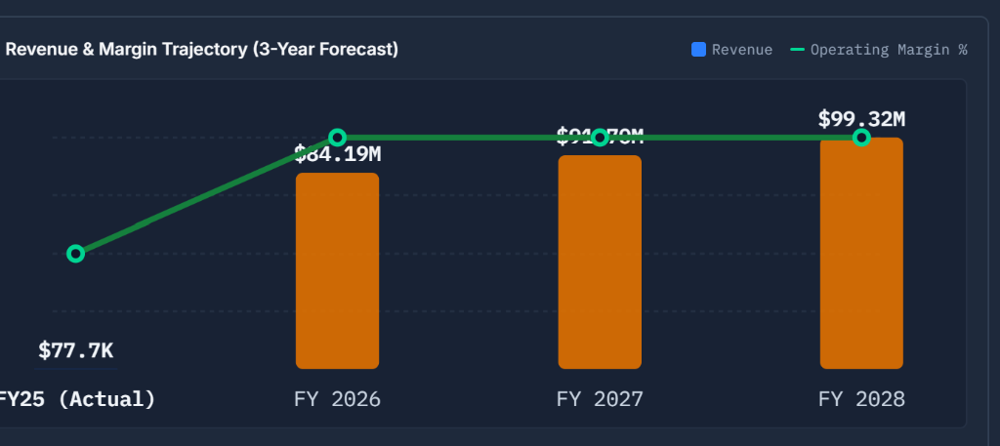
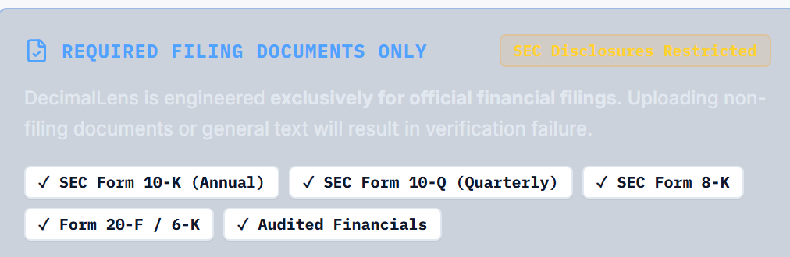

# Decimal Lens — Enterprise Financial Intelligence & Math Audit System

<div align="center">

  ### **AI-Native Single-Document Math Verification & Projections Pipeline**

  [](https://decimal-lens.vercel.app/)

  <br />

  [](https://decimal-lens.vercel.app/)
  [](https://nextjs.org/)
  [](https://tailwindcss.com/)
  [](https://fastapi.tiangolo.com/)
  [](https://docs.python.org/3/library/decimal.html)
  [](https://groq.com/)

  <br />

  **Deterministic math verification for corporate SEC filings • Dual-Agent auditing architecture • Zero floating-point accumulation errors**

</div>

---

## 📌 Live Deployment

Decimal Lens is deployed live on Vercel edge infrastructure:

👉 **[https://decimal-lens.vercel.app/](https://decimal-lens.vercel.app/)**

---

## 🏗️ System Architecture & Workflow Flowchart

Decimal Lens operates as a **Single-Document Extraction & Verification Pipeline**. The entire ingested document goes directly into an explicit **Two-Agent sequence**, combined with a **Python `decimal` module deterministic arithmetic engine** to eliminate math hallucinations before generating projections.



---

## 🌟 Feature Walkthrough & Visual Tour

### 1. Dual-Pane Audit Workspace (Source Viewer + Verification Grid)
The signature interface features a split layout: the left pane renders the official source filing (with click-to-highlight citation jumping), while the right pane displays extracted numeric metrics verified with 0 bps decimal precision.


*Figure 1: Split-view dashboard with source document viewer on the left and verified audit grid on the right.*

---

### 2. Deterministic Math Engine & Discrepancy Heatmap
Recomputes reported line items against underlying arithmetic formulas using Python's `decimal` module. Reported totals that fail deterministic calculation are flagged in red/amber with calculated variance bounds.


*Figure 2: Audit Health Bar and Discrepancy Variance Graph highlighting verified vs. flagged claims.*

---

### 3. Forecaster Projections & Magnitude Alignment Guardrail
The Forecaster Agent projects 3-year revenue and operating margin growth. It includes an automatic **Magnitude Alignment Guardrail**: if actual historical numbers and projected metrics differ by $>5\times$ order of magnitude, units are scaled dynamically ($77.7M vs $84.19M) to prevent unit distortion.


*Figure 3: 3-Year Projection Bar Chart with compact K/M/B/T formatting and magnitude alignment.*

---

### 4. Mandatory SEC Disclosures Banner & Financial Glossary
Displays filing constraint disclosures for SEC filings (Forms 10-K, 10-Q, 8-K) and embeds an interactive 8-term financial audit terminology glossary directly on the dashboard.


*Figure 4: Required Filing Disclosures callout banner and audit glossary.*

---

## 🛠️ Technology Stack

| Layer | Technologies Used |
| :--- | :--- |
| **Frontend** | Next.js 16 (App Router), React 19, TypeScript, Tailwind CSS v4, Motion (Framer Motion), TanStack Table, `cmdk`, `react-pdf` |
| **Backend** | Python 3.10+, FastAPI, Python `decimal` Module, `pypdf`, `uvicorn` |
| **AI Inference** | Groq Cloud (`llama-3.3-70b-versatile`) via OpenAI SDK Compatibility |
| **Deployment** | Vercel Monorepo Serverless Function (`api/index.py`) |

---

## 🚀 Getting Started Locally

### Prerequisites
- **Node.js**: `v18.0.0` or higher
- **Python**: `v3.10` or higher
- **Groq API Key**: Obtain a free API key from [Groq Console](https://console.groq.com/)

### 1. Clone the Repository
```bash
git clone https://github.com/devanshu1907/Decimal-Lens.git
cd Decimal-Lens
```

### 2. Set Up Environment Variables
Create a `.env.local` file in the root directory:
```env
GROQ_API_KEY="your_groq_api_key_here"
```

### 3. Install Dependencies
```bash
# Install Node.js frontend dependencies
npm install

# Set up Python backend virtual environment
python -m venv backend/venv
# On Windows:
backend\venv\Scripts\activate
# On macOS/Linux:
source backend/venv/bin/activate

pip install -r requirements.txt
```

### 4. Run Development Servers

**Run Next.js Frontend**:
```bash
npm run dev
```

**Run FastAPI Backend** *(in a second terminal)*:
```bash
backend\venv\Scripts\python.exe -m uvicorn backend.main:app --port 8000 --reload
```

Open [http://localhost:3000](http://localhost:3000) in your browser.

---

## 📄 License & Credits

Designed & Built by **Devanshu Yadav** — Built for financial analysts, auditors, and enterprise intelligence pipelines.
